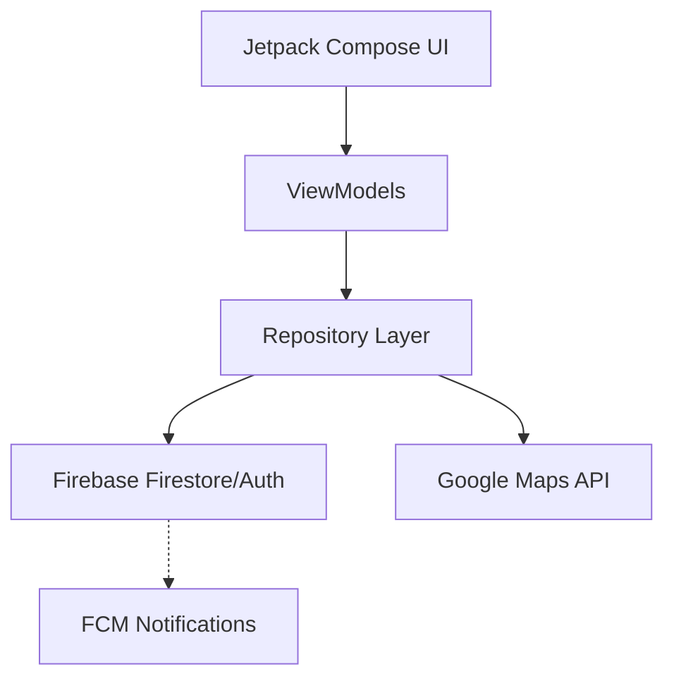
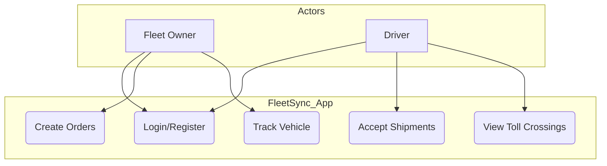
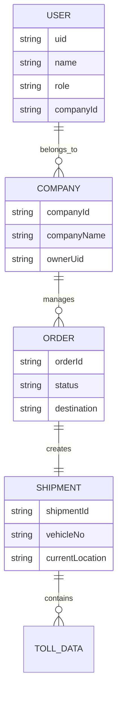
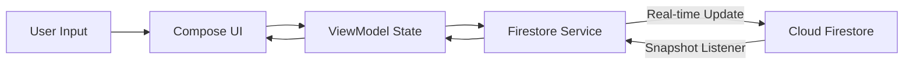
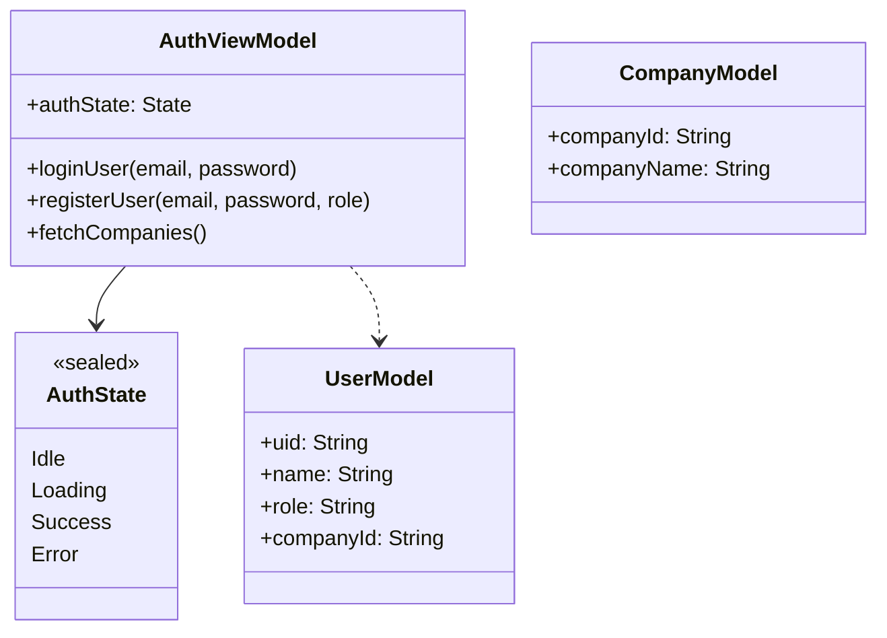
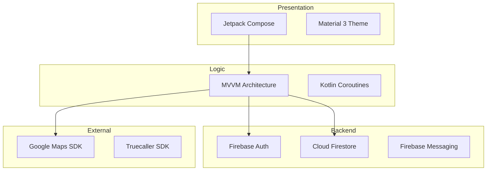

# FleetSync 🚚

FleetSync is a comprehensive fleet and shipment management Android application designed to provide real-time tracking, order management, and route monitoring for logistics and transport operations.

## ✨ Features

- **Real-time Shipment Tracking**: Track your fleet's progress with a detailed timeline view including source, destination, and toll plaza crossings.
- **Order Management**: View and manage active and past orders with a clean, modern UI.
- **Toll Progress Monitoring**: Keep track of toll crossings and remaining tolls in real-time during a trip.
- **Secure Authentication**: Integrated with Firebase Auth and Truecaller SDK for seamless and secure user verification.
- **Map Integration**: Visualize routes and vehicle locations using Google Maps.
- **Modern UI/UX**: Built entirely with Jetpack Compose and Material 3, supporting both Light and Dark modes.

## 📐 System Design & Architecture

### 1. UML Design (Component Diagram)


### 2. Use Case Diagram


### 3. ER Diagram


### 4. Data Flow Diagram


### 5. Class Diagram


### 6. Block Diagram


### 7. Timeline Chart (Shipment Lifecycle)
```mermaid


timeline
    title Shipment Lifecycle
    Order Created : Order details & destination set
    Vehicle Assigned : Driver accepts shipment
    Dispatched : Journey starts : Real-time tracking active
    En Route : Toll crossings : Route monitoring
    Delivered : Destination reached : Order completed
```

## 🛠 Tech Stack

- **Language**: Kotlin
- **UI Framework**: [Jetpack Compose](https://developer.android.com/jetpack/compose) (Material 3)
- **Architecture**: MVVM
- **Backend**: [Firebase Authentication](https://firebase.google.com/docs/auth), [Cloud Firestore](https://firebase.google.com/docs/firestore)
- **Maps**: [Google Maps Compose](https://github.com/googlemaps/android-maps-compose)
- **Networking**: OkHttp
- **SDKs**: Truecaller SDK, Google Play Services

## 🚀 Getting Started

### Prerequisites

- Android Studio Ladybug or later.
- Kotlin 2.0+
- A Google Maps API Key.
- A Firebase Project.

### Installation

1. **Clone the repository**:
   ```bash
   git clone https://github.com/your-username/FleetSync.git
   ```

2. **Firebase Setup**:
   - Create a project in the [Firebase Console](https://console.firebase.google.com/).
   - Add an Android app with the package name `com.example.fleetsync`.
   - Download `google-services.json` and place it in the `app/` directory.

3. **API Keys**:
   - Obtain a Google Maps API key from the [Google Cloud Console](https://console.cloud.google.com/).
   - Add your API key to `local.properties` or your manifest:
     ```xml
     <meta-data
         android:name="com.google.android.geo.API_KEY"
         android:value="YOUR_API_KEY_HERE" />
     ```

4. **Build and Run**:
   - Sync project with Gradle files.
   - Run the app on an emulator or a physical device.

## 📄 License

This project is licensed under the MIT License - see the [LICENSE](LICENSE) file for details.
