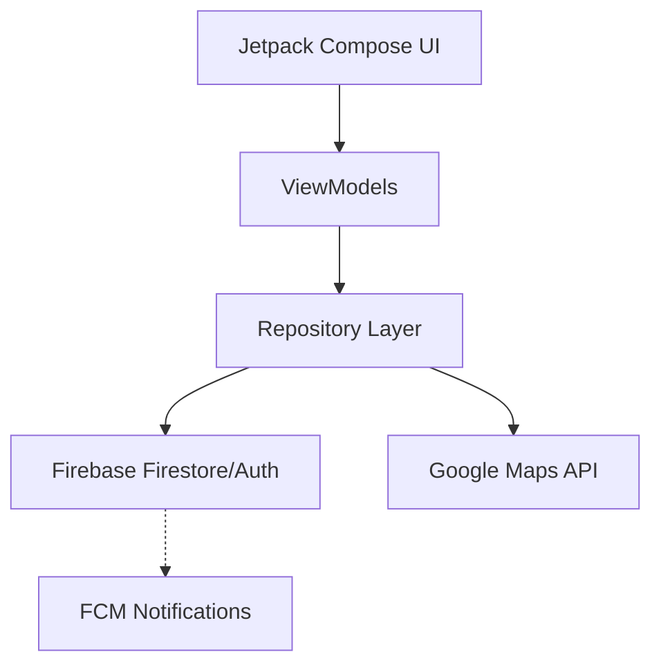
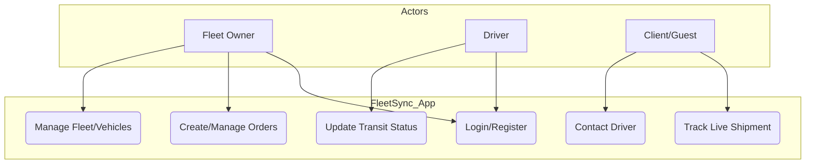
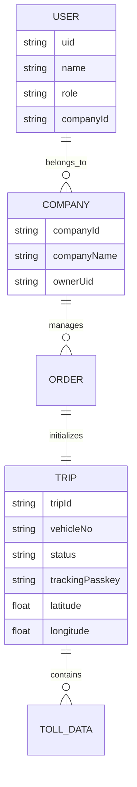
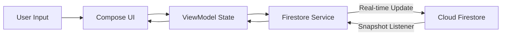
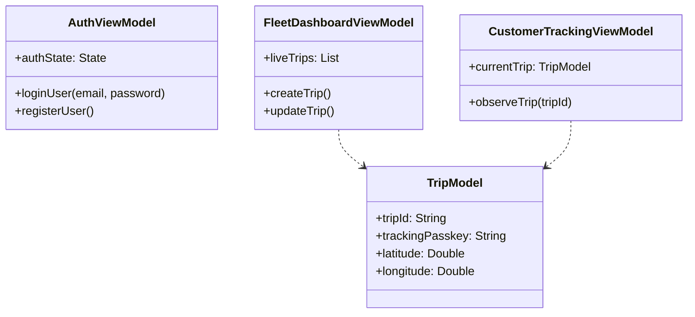
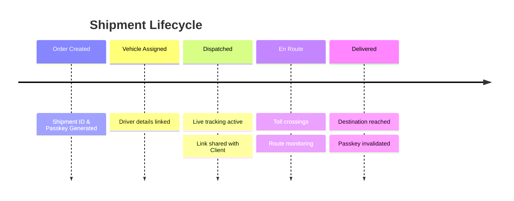

# FleetSync 🚚

FleetSync is a comprehensive fleet and shipment management Android application designed to provide real-time tracking, order management, and route monitoring for logistics and transport operations.

## ✨ Core Features

- **Real-time Shipment Tracking**: Track your fleet's progress with a detailed timeline view including source, destination, and toll plaza crossings.
- **Order Management**: View and manage active and past orders with a clean, modern UI.
- **Toll Progress Monitoring**: Keep track of toll crossings and remaining tolls in real-time during a trip using Google Maps Directions API.
- **Secure Guest Access**: Share shipment progress with clients via a non-guessable **Shipment ID** and a **6-digit Passkey**.
- **Live Location Streaming**: Clients can visualize the vehicle's real-time position on a map with automatic camera following.
- **Secure Authentication**: Integrated with Firebase Auth and Truecaller SDK for seamless and secure user verification.
- **Architecture**: Built entirely with Jetpack Compose and Material 3, following the MVVM architecture for scalability and performance.

## 📐 System Design & Architecture

### 1. Component Diagram (UML)

**Explanation**: This diagram illustrates the high-level architecture of FleetSync. The **Jetpack Compose UI** layer communicates with **ViewModels**, which manage the UI state. ViewModels interact with the **Repository Layer** to fetch data from **Firebase** (Firestore and Auth) and **Google Maps API**. Real-time updates from Firestore trigger notifications via **FCM**.

### 2. Use Case Diagram

**Explanation**: This diagram identifies the primary users and their actions. **Fleet Owners** manage the fleet, vehicles, and orders. **Drivers** are responsible for updating the transit status and location. **Clients** can track their specific shipments securely and contact the driver directly.

### 3. Entity Relationship (ER) Diagram

**Explanation**: FleetSync's data model revolves around the **User** and their **Company**. A company manages multiple **Orders**, each associated with a **Trip**. The Trip entity stores critical real-time data such as current coordinates and the secure tracking passkey.

### 4. Data Flow Diagram (DFD)

**Explanation**: This shows the reactive data loop. User actions in the **Compose UI** update the **ViewModel**, which writes to **Firestore**. Firestore then pushes real-time updates back to the UI via **Snapshot Listeners**, ensuring the client and owner see identical, live data.

### 5. Class Diagram

**Explanation**: The application logic is modularized into specialized ViewModels. `AuthViewModel` handles identity, `FleetDashboardViewModel` manages the owner's perspective, and `CustomerTrackingViewModel` provides a lightweight, secure bridge for guest clients to monitor their specific `TripModel`.

### 6. Shipment Lifecycle (Timeline)

**Explanation**: This chart maps the journey of a shipment. A crucial security feature is the automatic **invalidation of the passkey** once a shipment is marked as "Delivered," protecting sensitive logistics data.

## ⚙️ Detailed Functionalities

### 1. Fleet Owner Dashboard
- **Comprehensive Overview**: Real-time counts of active vehicles, pending orders, and critical alerts.
- **Order Creation**: Intelligent order setup that automatically calculates ETA and toll plazas using Google Maps APIs.
- **Fleet Management**: Add and manage vehicles (ID, Type, Fuel) and drivers.
- **Secure Sharing**: One-tap "Share Tracking" feature that generates a message with Shipment ID, Passkey, and Driver contact details.

### 2. Driver Application
- **Location Streaming**: Foreground service that streams high-accuracy GPS coordinates to Firestore.
- **Status Control**: Ability to update shipment status (Dispatched, In Transit, Delivered).
- **Toll Management**: Simple interface to mark tolls as "Crossed" during the journey.

### 3. Client Tracking Portal
- **Secure Login**: Access tracking via a unique Shipment ID (e.g., FS-12345) and a 6-digit Passkey.
- **Live Map**: Interactive map showing the vehicle's movement with auto-follow capability.
- **Journey Metrics**: Real-time display of ETA (EST), Distance remaining, and Tolls crossed.
- **Direct Contact**: Built-in "Call Driver" button that opens the phone's dialer with the driver's number.

## 🛠 Tech Stack

- **Language**: Kotlin 2.0+
- **UI Framework**: Jetpack Compose (Material 3)
- **Architecture**: MVVM with Kotlin Coroutines
- **Backend**: Firebase (Auth, Firestore, FCM)
- **Maps**: Google Maps SDK for Android & Compose
- **Networking**: OkHttp for Google Directions API

## 🚀 Getting Started

1. **Clone the repository**: `git clone https://github.com/your-username/FleetSync.git`
2. **Firebase Setup**: Add your `google-services.json` to the `app/` directory.
3. **API Keys**: Add your Google Maps API Key to `local.properties`.
4. **Build**: Sync Gradle and run on Android Studio Ladybug or later.

## 📄 License

This project is licensed under the MIT License.
